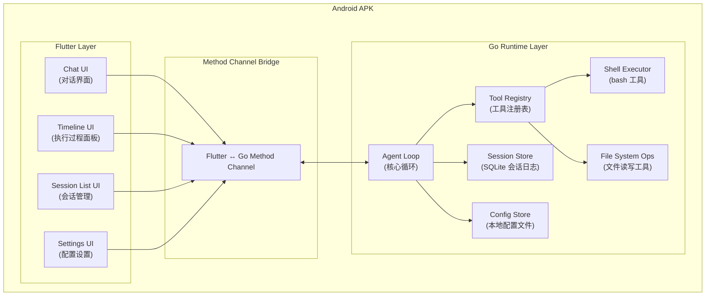

# Design Document — dsh-android-apk

Feature Name: harness-android-apk
Updated: 2026-08-14

## Description

将 DeepSeek Harness 的 Agent 运行时重构为 Android APK，采用 Flutter 作为 UI 层、Go (Go Mobile) 作为核心运行时层，所有数据和配置纯本地存储。整体架构分为三层：Flutter UI、Method Channel 通信桥、Go Runtime。

## Architecture



## Architecture Explanation

应用采用分层架构，共三层：

1. **Flutter UI 层**：负责所有用户交互界面，包括对话视图、执行过程时间线、会话列表、设置页面。使用 Flutter 的 Riverpod 进行状态管理。

2. **Method Channel 桥接层**：Flutter 通过标准 MethodChannel 与 Go 运行时通信。所有异步调用通过事件流（EventChannel）返回增量结果。

3. **Go Runtime 层**：核心 Agent 逻辑，包含 agent loop、工具注册表、会话持久化、配置管理。所有工具通过 Go 原生实现，不依赖 Node.js 运行时。

## Components and Interfaces

### Component 1: AgentLoop (Go)

位置：`go/runtime/agent/loop.go`

核心 Agent 循环，对应原 deepseek-harness 的 `packages/core/agent-loop`。

```go
type AgentLoop struct {
    sessionID     SessionID
    tools         *ToolRegistry
    sessionStore  *SessionStore
    config        *ConfigStore
    abortCh       chan struct{}
    eventStream   chan AgentEvent
}

type AgentLoopConfig struct {
    MaxTurns          int
    ToolTimeoutMs     int
    MaxParallelCalls  int
}

func NewAgentLoop(id SessionID, tools *ToolRegistry, store *SessionStore, cfg ConfigStore) *AgentLoop
func (a *AgentLoop) Run(prompt string) (<-chan AgentEvent, error)
func (a *AgentLoop) Abort()
```

### Component 2: ToolRegistry (Go)

位置：`go/runtime/tools/registry.go`

工具注册与调度，对应原 `packages/core/tools`。

```go
type ToolRegistry struct {
    tools map[string]Tool
}

type Tool interface {
    Name() string
    Schema() json.RawMessage
    Execute(args json.RawMessage, ctx ToolContext) (json.RawMessage, error)
}

type ToolContext struct {
    SessionID SessionID
    AbortSignal <-chan struct{}
}

func (r *ToolRegistry) Register(t Tool)
func (r *ToolRegistry) Get(name string) (Tool, bool)
```

### Component 3: ShellTool (Go)

位置：`go/runtime/tools/bash.go`

Bash 命令执行工具，对应原 `packages/shell/tool-bash`。

```go
type BashTool struct {
    timeoutMs int
}

func (t *BashTool) Name() string { return "bash" }
func (t *BashTool) Schema() json.RawMessage
func (t *BashTool) Execute(args json.RawMessage, ctx ToolContext) (json.RawMessage, error)
```

### Component 4: FileSystemTools (Go)

位置：`go/runtime/tools/fs.go`

文件读写编辑工具集合，对应原 `packages/fs/tool-fs`。

```go
type ReadFileTool struct { ... }
type WriteFileTool struct { ... }
type EditFileTool struct { ... }
type SearchFilesTool struct { ... }
type ReadImageTool struct { ... }
```

### Component 5: SessionStore (Go)

位置：`go/runtime/session/store.go`

本地 SQLite 会话持久化，对应原 `packages/session/session-persistence-sqlite`。

```go
type SessionStore struct {
    db *sql.DB
}

type SessionEvent struct {
    ID        int64
    SessionID string
    Type      string
    Payload   json.RawMessage
    Timestamp time.Time
}

func (s *SessionStore) CreateSession(id SessionID) error
func (s *SessionStore) AppendEvent(sessionID SessionID, event SessionEvent) error
func (s *SessionStore) GetEvents(sessionID SessionID, afterID int64, limit int) ([]SessionEvent, error)
func (s *SessionStore) DeleteSession(id SessionID) error
func (s *SessionStore) GetSessionHeader(id SessionID) (*SessionHeader, error)
```

### Component 6: ConfigStore (Go)

位置：`go/runtime/config/store.go`

本地 JSON 配置文件管理。

```go
type ConfigStore struct {
    path string
}

type App sagConfig struct {
    Agent AgentConfig `json:"agent"`
    Tools ToolConfig `json:"tools"`
    UI    UIConfig   `json:"ui"`
}

type AgentConfig struct {
    MaxTurns      int  `json:"maxTurns"`
    ToolTimeoutMs int  `json:"toolTimeoutMs"`
}

func NewConfigStore(dir string) *ConfigStore
func (c *ConfigStore) Load() (*App sagConfig, error)
func (c *ConfigStore) Save(cfg *App sagConfig) error
func (c *ConfigStore) DefaultPath() string
```

### Component 7: Flutter Go Bridge (Dart)

位置：`lib/bridge/go_bridge.dart`

Flutter 到 Go 的 Method Channel 封装。

```dart
class GoBridge {
    static const MethodChannel _methodChannel =
        MethodChannel('com.deepseek.harness/agent');
    static const EventChannel _eventChannel =
        EventChannel('com.deepseek.harness/events');

    Future<SessionResult> startSession(String prompt);
    Stream<AgentEvent> getEventStream(String sessionId);
    Future<void> abortSession(String sessionId);
    Future<List<SessionSummary>> listSessions();
    Future<void> deleteSession(String sessionId);
    Future<App sagConfig> loadConfig();
    Future<void> saveConfig(App sagConfig config);
}
```

### Component 8: ChatView (Flutter)

位置：`lib/views/chat_view.dart`

对话界面，显示消息历史和新消息输入框。

```dart
class ChatView extends ConsumerStatefulWidget {
    final String sessionId;
    const ChatView({required this.sessionId});
}

class _ChatViewState extends ConsumerState<ChatView> {
    // 消息列表、输入框、发送逻辑
}
```

### Component 9: TimelinePanel (Flutter)

位置：`lib/views/timeline_panel.dart`

执行过程面板，实时展示 Agent 的工具调用链。

```dart
class TimelinePanel extends ConsumerStatefulWidget {
    final String sessionId;
    const TimelinePanel({required this.sessionId});
}

// 每个 ToolCallItem 展示工具名、参数、结果、状态
```

### Component 10: SessionList (Flutter)

位置：`lib/views/session_list.dart`

会话列表管理界面。

```dart
class SessionList extends ConsumerStatefulWidget {
    const SessionList();
}

// 会话列表、新建、删除、重命名、归档
```

## Data Models

### SessionEvent (本地存储)

```json
{
  "id": 1001,
  "session_id": "sess_abc123",
  "type": "user_message",
  "payload": { "content": "帮我分析这个目录" },
  "timestamp": "2026-08-14T10:30:00Z"
}
```

事件类型枚举：
- `user_message` — 用户输入
- `assistant_message` — Agent 回复
- `tool_call_start` — 工具调用开始
- `tool_call_result` — 工具调用结果
- `turn_start` — 轮次开始
- `turn_complete` — 轮次结束
- `error` — 错误事件

### AppConfig

```json
{
  "agent": {
    "maxTurns": 50,
    "toolTimeoutMs": 30000,
    "maxParallelCalls": 3
  },
  "tools": {
    "bash": { "enabled": true, "timeoutMs": 60000 },
    "filesystem": { "enabled": true, "readLimit": 1000 }
  },
  "ui": {
    "theme": "system",
    "fontSize": "medium",
    "showTimeline": true
  }
}
```

## Correctness Properties

1. **Session Integrity**: 每次事件写入后，SQLite 事务提交成功，会话日志永不丢失已提交的事件。

2. **Cancellation Safety**: Agent loop 收到 abort 信号后，所有在途工具调用在 2 秒内终止，不会留下孤儿进程。

3. **Config Consistency**: 配置文件保存成功后立即可读；保存失败时保留上一有效版本。

4. **UI Responsiveness**: 所有 Go 运行时调用通过异步方法通道执行，Flutter UI 线程永不阻塞。

5. **Event Ordering**: 同一会话的增量事件按时间顺序到达 Flutter 端，不乱序、不重复。

## Error Handling

| 错误场景 | 处理方式 |
|---------|---------|
| Go 运行时初始化失败 | 显示 FatalErrorScreen，提供重启按钮 |
| SQLite 写入失败 | 缓冲事件，下次启动时重试；最多重试 3 次后标记为不可恢复 |
| 工具执行超时 | 返回 timeout error，Agent 决定后续动作 |
| 方法通道断连 | 显示 ErrorToast，尝试重连一次；失败后提示重启应用 |
| 配置文件格式错误 | 使用默认配置，记录警告日志，提示用户重新设置 |
| 会话日志损坏 | 尝试从最后检查点修复；修复失败则创建新会话并通知用户 |

## Test Strategy

### Unit Tests (Go)

- `go/runtime/agent/loop_test.go` — Agent 循环逻辑测试
- `go/runtime/tools/bash_test.go` — Bash 工具边界条件测试
- `go/runtime/tools/fs_test.go` — 文件操作工具测试
- `go/runtime/session/store_test.go` — SQLite 持久化测试

### Integration Tests (Dart)

- `test/bridge/go_bridge_test.dart` — Method Channel 通信测试
- `test/views/chat_view_test.dart` — 对话 UI 交互测试
- `test/views/timeline_panel_test.dart` — 时间线 UI 测试

### E2E Tests

使用 integration_test 框架，覆盖核心用户流程：
1. 启动应用 → 新建会话 → 发送消息 → 查看 Agent 响应
2. 执行多步任务 → 观察工具调用时间线 → 验证结果
3. 切换会话 → 验证历史记录恢复
4. 修改配置 → 验证持久化

## References

- [DeepSeek Harness Architecture](../../../deepseek-ai-deepseek-harness-47f9438/docs/architecture.md)
- [Go Mobile Bind Documentation](https://pkg.go.dev/golang.org/x/mobile/bind)
- [Flutter Method Channel](https://docs.flutter.dev/platform-integration/platform-channels)
- [Riverpod State Management](https://riverpod.dev/)
